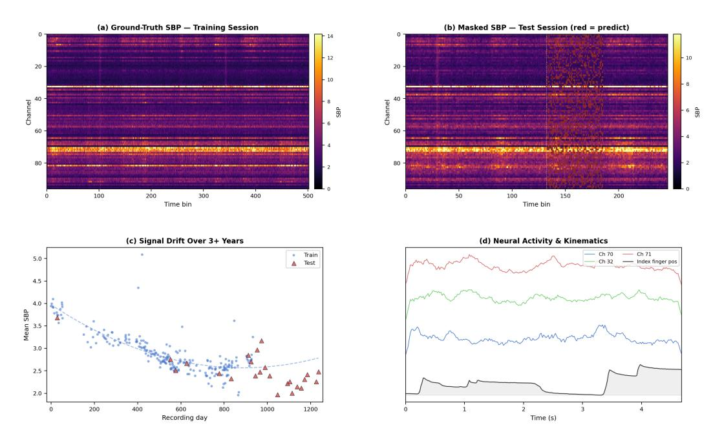

# CS-GY 9223 / CS-UY 3943 - Neuroinformatics, Spring 2026

Project 2: Long-Term Intracortical Neural Activity Decoding

# **Important Links & Deadline**

**Kaggle Competition:** [Join Competition \(Kaggle Link\)](https://www.kaggle.com/t/fc965eca70394124a479ac798880e52f) **Team Sign-Up Sheet:** [Sign Up Here \(Google Sheets\)](https://docs.google.com/spreadsheets/d/1FkuCEk2ETyqNtteWR_IoJg2DhGQnBsFzMuGByVw21O0/edit?usp=sharing)

**Deadline: March 17, 2026 at 11:59 PM EST Code Submission:** Upload zipped code to **Brightspace**

#### **Phase 1 of 2**

This is **Phase 1** of a two-phase project.

- **Phase 1** focuses on predicting masked neural activity (self-supervised reconstruction).
- **Phase 2** (after spring break) will focus on **decoding finger movements from neural signals** (supervised prediction of kinematics).
- Strong representations learned in Phase 1 may carry over to Phase 2.

**Note:** You are allowed to use pre-built libraries (PyTorch, TensorFlow, scikit-learn, etc.) to implement your solution. You are free to use any pretrained models or additional datasets as well.

#### **Submission Instructions:**

- Submit a **final zipped code file** as your project submission on Brightspace.
- Use **Markdown cells** in notebook or neatly comment your code to include explanations wherever needed.
- You are allowed to use **LLMs**. If you do:
  - **–** Include the **chat history** you had with the LLM along with your submission.
  - **–** This helps us understand your **thinking style**.

- Participate in the **[Kaggle competition](https://www.kaggle.com/t/fc965eca70394124a479ac798880e52f)** and submit your submission.csv file there.
- **Participation in Kaggle is mandatory, and your** *private leaderboard* **ranking will be used for final Project 2 Phase 1 scoring.**

#### **Competition At A Glance:**

| Item          | Details                                                    |
|---------------|------------------------------------------------------------|
| Training Data | 226 sessions of 96-channel intracortical neural recordings |
| Test Data     | 24 sessions (masked SBP entries hidden)                    |
| Evaluation    | ∼469K masked SBP entries<br>NMSE on                        |
| Baseline      | ≈<br>Per-channel mean (NMSE<br>1.006)                      |

#### **Quick Start:**

- 1. Sign up your team on the [Team Sign-Up Sheet](https://docs.google.com/spreadsheets/d/1FkuCEk2ETyqNtteWR_IoJg2DhGQnBsFzMuGByVw21O0/edit?usp=sharing)
- 2. Join the [Kaggle competition](https://www.kaggle.com/t/fc965eca70394124a479ac798880e52f) and download the dataset
- 3. Explore the 226 training sessions (SBP, kinematics, trial info)
- 4. Train your model to predict masked SBP values
- 5. Generate predictions for all ∼469K masked entries in 24 test sessions
- 6. Submit your submission.csv to Kaggle
- 7. Submit your code/notebook to Brightspace before the deadline

# **Contents**

| 1 |     | Problem Statement<br>4                        |  |
|---|-----|-----------------------------------------------|--|
|   | 1.1 | Background<br><br>4                           |  |
|   | 1.2 | Challenge Goal<br><br>4                       |  |
|   | 1.3 | What You Will Learn<br><br>4                  |  |
| 2 |     | Data Description<br>4                         |  |
|   | 2.1 | Dataset Overview<br><br>4                     |  |
|   | 2.2 | Recording Setup<br><br>5                      |  |
|   | 2.3 | Signal Drift<br><br>5                         |  |
|   | 2.4 | Masking Structure<br><br>5                    |  |
|   | 2.5 | File Structure<br><br>6                       |  |
|   | 2.6 | metadata.csv<br><br>6                         |  |
|   | 2.7 | NumPy File Details<br><br>6                   |  |
| 3 |     | Evaluation Metrics<br>7                       |  |
|   | 3.1 | Normalized Mean Squared Error (NMSE)<br><br>7 |  |
|   | 3.2 | Final Scoring<br><br>7                        |  |
|   | 3.3 | Public/Private Leaderboard Split<br><br>7     |  |
|   | 3.4 | Reference Scores<br><br>8                     |  |
| 4 |     | Submission Instructions<br>8                  |  |
|   | 4.1 | Required Output<br><br>8                      |  |
|   | 4.2 | Creating a Submission<br><br>8                |  |
|   | 4.3 | Loading Data<br><br>9                         |  |
|   | 4.4 | Important Requirements<br><br>9               |  |
| 5 |     | Glossary<br>10                                |  |

# <span id="page-3-0"></span>**1 Problem Statement**

#### <span id="page-3-1"></span>**1.1 Background**

Intracortical brain–computer interfaces (iBCIs) record neural activity from electrode arrays implanted in the brain. These devices hold promise for restoring communication and motor control in people with paralysis. A major challenge is **neural signal drift** — signal statistics change over days, weeks, and months due to electrode migration, tissue remodeling, and neural plasticity. Decoders trained on one day's data can degrade significantly when applied to recordings from a different day.

## <span id="page-3-2"></span>**1.2 Challenge Goal**

**Can we predict masked neural activity across sessions that span months to years of signal drift?**

**Task:** Given long-term intracortical recordings spanning hundreds of sessions over multiple years from a non-human primate, **predict masked Spiking Band Power (SBP)** values in held-out test sessions given partial observations — a self-supervised reconstruction task analogous to image inpainting or masked language modeling.

## <span id="page-3-3"></span>**1.3 What You Will Learn**

- How neural signals are structured (spatial correlations across channels, temporal dynamics)
- How signal statistics drift over long timescales
- Techniques for building models that generalize across non-stationary distributions

# <span id="page-3-4"></span>**2 Data Description**

#### <span id="page-3-5"></span>**2.1 Dataset Overview**

The dataset consists of recordings from a 96-channel intracortical electrode array (two 64 channel Utah arrays) implanted in the motor cortex of a non-human primate. During each recording session, the subject performed a finger-movement task while neural activity was captured.

Table 1: Dataset Summary

| Split | Sessions | Channels | Time Bins / Session | Sampling Rate |
|-------|----------|----------|---------------------|---------------|
| Train | 226      | 96       | ∼21K–35K            | 50 Hz         |
| Test  | 24       | 96       | ∼21K–35K            | 50 Hz         |

### <span id="page-4-0"></span>**2.2 Recording Setup**

- **96 channels** from two 64-channel Utah arrays in motor cortex
- **Spiking Band Power (SBP):** power in the spiking frequency band, extracted at 50 Hz (20 ms bins). Shape: (N bins, 96)
- **Finger Kinematics:** 4 variables index position, MRP position, index velocity, MRP velocity — normalized to [0, 1]. Shape: (N bins, 4)
- Each session: ∼375 trials, ∼21K–35K time bins (∼7–11 min of data)
- Recording span: ∼1,200+ days across 250 sessions

### <span id="page-4-1"></span>**2.3 Signal Drift**

Mean SBP amplitude drops ∼42% over the recording span. Test sessions range from 0 to 300+ days away from the nearest training session — your model must handle both interpolation (near training data) and extrapolation (far from training data).

## <span id="page-4-2"></span>**2.4 Masking Structure**

In each of the 24 test sessions, 10 trials are held out. Within each held-out trial, 30 of 96 channels are randomly masked (set to zero) at every time bin. You must predict the original SBP values at all ∼469K masked locations.



Figure 1: Dataset overview. (a) Ground-truth SBP heatmap from a training session (96 channels × time). (b) Test session with masked region highlighted in red — 30 of 96 channels are masked per time bin in held-out trials. (c) Signal drift: mean SBP declines ∼42% over 3+ years; test sessions (triangles) span the full timeline. (d) Neural activity traces alongside finger kinematics, showing neural–behavioral coupling.

#### **What you have access to:**

- 66 observed channels at each masked time bin (spatial context)
- All non-held-out trials in the same session (temporal context)
- Full kinematics for all test sessions (behavioral context)
- All 226 training sessions (cross-session context)

## <span id="page-5-0"></span>**2.5 File Structure**

Listing 1: Dataset File Structure

```
train/
           –session˙id˝˙sbp.npy # (N, 96) SBP values
           –session˙id˝˙kinematics.npy # (N, 4) finger kinematics
           –session˙id˝˙trial˙info.npz # trial start/end bins
     test/
           –session˙id˝˙sbp˙masked.npy # (N, 96) masked entries = 0
           –session˙id˝˙mask.npy # (N, 96) True = masked
           –session˙id˝˙kinematics.npy # (N, 4) full kinematics
           –session˙id˝˙trial˙info.npz
     metadata.csv # session˙id, day, split, n˙bins, n˙trials
     sample˙submission.csv # template: sample˙id, session˙id, time˙bin,
channel
     test˙mask.csv # all masked entries listed
     metric.py # official scoring function
```

### <span id="page-5-1"></span>**2.6 metadata.csv**

Table 2: Metadata Columns

| Column        | Description                                                        |
|---------------|--------------------------------------------------------------------|
| session<br>id | Anonymous session identifier (S001, S002, ) in chronological order |
| day           | Relative recording day (day 0 = first session)                     |
| split         | train<br>or<br>test                                                |
| n<br>bins     | Number of time bins in the session (∼22K–34K at 50 Hz)             |
| n<br>trials   | Number of trials in the session                                    |

## <span id="page-5-2"></span>**2.7 NumPy File Details**

#### **Training sessions** (train/):

- {sid} sbp.npy Float32 (N, 96). Full SBP values, one column per electrode.
- {sid} kinematics.npy Float32 (N, 4). Columns: [index pos, mrp pos, index vel, mrp vel], normalized to [0, 1].
- {sid} trial info.npz Contains start bins, end bins, and n trials.

#### **Test sessions** (test/):

- {sid} sbp masked.npy Float32 (N, 96). SBP with masked entries set to 0.
- {sid} mask.npy Boolean (N, 96). True = masked (must predict).
- {sid} kinematics.npy Float32 (N, 4). Full kinematics, not masked.
- {sid} trial info.npz Same format as training.

# <span id="page-6-0"></span>**3 Evaluation Metrics**

Submissions are evaluated by comparing your predicted SBP values to the hidden ground truth at all masked locations across **24 test sessions** (∼469K total masked entries).

### <span id="page-6-1"></span>**3.1 Normalized Mean Squared Error (NMSE)**

NMSE measures prediction accuracy while normalizing for differences in signal magnitude across channels and sessions. For session s and channel c with nsc masked entries:

$$NMSE(s,c) = \frac{1}{Var_s(c)} \cdot \frac{1}{n_{sc}} \sum_{i=1}^{n_{sc}} (\hat{y}_i - y_i)^2$$
 (1)

where Vars(c) is the variance of channel c over *all* time bins in session s.

#### <span id="page-6-2"></span>**3.2 Final Scoring**

The final leaderboard score is the average NMSE across all (session, channel) groups:

Final Score = 
$$\frac{1}{|\mathcal{G}|} \sum_{(s,c) \in \mathcal{G}} \text{NMSE}(s,c)$$
 (2)

**Range:** [0, ∞) where 0 indicates perfect prediction (lower is better).

Table 3: NMSE Interpretation

| NMSE   | Meaning                                       |
|--------|-----------------------------------------------|
| = 0    | Perfect prediction                            |
| <<br>1 | Model captures meaningful signal structure    |
| = 1    | Equivalent to predicting the per-channel mean |
| ><br>1 | Worse than the trivial baseline               |

# <span id="page-6-3"></span>**3.3 Public/Private Leaderboard Split**

Table 4: Leaderboard Configuration

| Leaderboard          | Entries           | Percentage |  |  |
|----------------------|-------------------|------------|--|--|
| Total Masked Entries | ∼469K             | 100%       |  |  |
| Public               | ∼234K (random)    | 50%        |  |  |
| Private              | ∼235K (remaining) | 50%        |  |  |

The random split ensures that entries from all sessions and channels contribute to both leaderboards, preventing overfitting to specific subsets. The final ranking uses the **private** portion. On the Kaggle leaderboard, a **lower NMSE** corresponds to a **higher rank**.

#### <span id="page-7-0"></span>**3.4 Reference Scores**

Table 5: Reference Scores (NMSE)

| Submission                | NMSE  |  |
|---------------------------|-------|--|
| Per-channel mean baseline | 1.006 |  |
| Perfect prediction        | 0.000 |  |

**Goal:** Achieve NMSE well below 1.0, demonstrating that your model captures meaningful signal structure beyond the trivial baseline.

# <span id="page-7-1"></span>**4 Submission Instructions**

# <span id="page-7-2"></span>**4.1 Required Output**

Submit a CSV file with five columns and ∼469K rows (one per masked entry):

| Table 6: Submission File Format |                                                    |
|---------------------------------|----------------------------------------------------|
| Column                          | Description                                        |
| sample<br>id                    | Integer index matching<br>sample<br>submission.csv |
| session<br>id                   | Which test session (e.g., S008)                    |
| time<br>bin                     | Time bin index into the session's NumPy arrays     |
| channel                         | SBP channel index (0–95)                           |
| predicted<br>sbp                | Your predicted SBP value (float, no NaN/Inf)       |

#### Example rows:

```
sample˙id,session˙id,time˙bin,channel,predicted˙sbp
0,S008,998,1,3.72
1,S008,998,2,4.15
2,S008,998,6,2.89
...
```

#### <span id="page-7-3"></span>**4.2 Creating a Submission**

Listing 2: Generating a Submission

```
import pandas as pd
sub = pd.read˙csv("sample˙submission.csv")
# sub columns: sample˙id, session˙id, time˙bin, channel, predicted˙sbp
```

```
# Replace predicted˙sbp with your predictions
# ... your model logic here ...
sub.to˙csv("submission.csv", index=False)
```

## <span id="page-8-0"></span>**4.3 Loading Data**

Listing 3: Loading Data Example

```
import numpy as np, pandas as pd
# Training session
sbp = np.load("train/S001˙sbp.npy") # (N, 96)
kin = np.load("train/S001˙kinematics.npy") # (N, 4)
trials = np.load("train/S001˙trial˙info.npz") # start˙bins, end˙bins
# Test session
sbp˙m = np.load("test/S230˙sbp˙masked.npy") # (N, 96) masked=0
mask = np.load("test/S230˙mask.npy") # (N, 96) True=masked
kin = np.load("test/S230˙kinematics.npy") # (N, 4)
# Metadata
meta = pd.read˙csv("metadata.csv")
train˙ids = meta[meta["split"]=="train"]["session˙id"].tolist()
test˙ids = meta[meta["split"]=="test"]["session˙id"].tolist()
```

### <span id="page-8-1"></span>**4.4 Important Requirements**

- 1. **Column names**: Exactly sample id,session id,time bin,channel,predicted sbp
- 2. **Row count**: Must match sample submission.csv
- 3. **No nulls**: All predicted sbp values must be finite numbers
- 4. **Encoding**: UTF-8 CSV
- 5. **Row order**: Does not matter; rows are matched by sample id

# <span id="page-9-0"></span>**5 Glossary**

Table 7: Terminology

| Term         | Definition                                                           |
|--------------|----------------------------------------------------------------------|
| iBCI         | Intracortical Brain–Computer Interface                               |
| SBP          | Spiking Band Power (neural feature extracted from electrode signals) |
| Utah Array   | Microelectrode array for intracortical recording                     |
| NMSE         | Normalized Mean Squared Error (evaluation metric)                    |
| Motor Cortex | Brain region controlling voluntary movement                          |
| Signal Drift | Change in neural signal statistics over time                         |
| MRP          | Middle-Ring-Pinky (finger group)                                     |
| Time Bin     | 20 ms interval (50 Hz sampling)                                      |

**Good luck!** We look forward to seeing innovative approaches to this challenging problem.